# Manual do Usuário — Transkriptor

Transkriptor é um aplicativo para **Windows** que fica na **bandeja do sistema**, detecta **Google Meet**, transcreve o áudio em segundo plano (Whisper offline), separa vozes (diarização) e oferece um **assistente local** via Ollama.

Durante uma reunião aceita, o aplicativo faz apenas a captura leve do áudio. O
Whisper e a separação de vozes entram no **processamento após a reunião**, em um
processo separado e de prioridade baixa. Isso mantém a chamada responsiva.

Tudo roda no seu computador — transcrições e perfis de voz ficam em disco local.

---

## 1. Instalação

### Requisitos

- Windows 10 ou 11
- Python 3.12 ou superior
- Microfone (para identificar sua voz como `VOCÊ`)
- Opcional: GPU NVIDIA com CUDA (acelera o Whisper)
- Opcional: [Ollama](https://ollama.com) instalado (assistente de resumo/perguntas)
- Opcional: Google Chrome (extensão para nomes no Meet)

### Passo a passo

1. Extraia ou clone o projeto em uma pasta, por exemplo `C:\projetos\transkriptor`.
2. Execute `instalar.bat`. Ele cria `.venv`, escolhe CPU ou CUDA, instala pelo
   lock com hashes (`requirements/requirements-cpu.lock` ou `requirements/requirements-cuda.lock`), executa
   `pip check` e cria o atalho. Não instale PyTorch separadamente na mesma `.venv`.
3. Inicie pelo atalho **Transkriptor** ou `iniciar_bandeja.bat` (usa o `.venv`).
4. O ícone aparece na bandeja (seta ^ se estiver oculto).
5. Para remover, use `desinstalar.bat` depois de sair do app. Ele preserva
   transcrições, áudio, perfil de voz e configuração por padrão; apagar dados
   exige uma segunda escolha explícita.

### Primeira execução

- O app cria a pasta `transcricoes/`. Em instalação nova, o **modo protegido**
  grava o resultado em `.tkpt` e o áudio em TKAS/1 (`.tks`), sem `.txt` aberto
  como resultado principal. Instalações existentes sem a opção de proteção
  mantêm o modo compatível, com `.txt`, até escolha explícita.
- Na primeira execução, gera a chave local protegida por DPAPI em
  `_modelo_voz/transkriptor_key.dpapi`, separada da configuração.
- Modelos Whisper e de voz baixam no primeiro processamento após uma reunião
  (pode demorar alguns minutos).
- Apenas **uma instância** pode rodar; uma segunda exibe aviso e encerra.

---

## 2. Bandeja do sistema

Clique com o **botão direito** no ícone da bandeja para abrir o menu.

| Item | Função |
|------|--------|
| Status (primeira linha) | O que o app está fazendo agora: Aguardando reunião, Gravando, Processando reunião, Separando vozes, Pausado ou Erro — o mesmo vocabulário da Central |
| Abrir Transkriptor | Abre a Central (Início, Reuniões, Assistente, Participantes, Configurações, Diagnóstico) no navegador, em janela de aplicativo quando há Edge ou Chrome |
| Gravação automática | Marcado = detecta reuniões e pergunta antes de gravar. Desmarcar exige confirmação e significa **não gravar** reuniões |
| Separar vozes | Marcado = separa quem falou o quê ao terminar a reunião |
| Reuniões ▸ | Abrir assistente (IA local), Renomear falante e participantes (Central), Retranscrever áudio… (Central), Abrir pasta de transcrições |
| Configurações ▸ Minha voz | Cadastrar minha voz (20s), Identificar minha voz (marcado = rótulo `VOCÊ`), Apagar perfil de voz, Abrir pasta vozes conhecidas |
| Configurações ▸ Google Meet | Identificar nomes do Meet (marcado = ponte local ligada), Modo legendas Meet (Tactiq), Instalar extensão Meet (pasta) |
| Configurações ▸ Proteção | Criar cópia criptografada (.tkpt) (marcado), Ativar modo protegido para novas reuniões… (com confirmação) |
| Configurações ▸ Modelo Whisper | Escolha do modelo; vale a partir da próxima transcrição |
| Configurações ▸ Iniciar com o Windows | Marcado = atalho na pasta de inicialização |
| Configurações ▸ Abrir log | Abre `transkriptor.log` |
| Diagnóstico (por que não está gravando?) | Abre a página Diagnóstico da Central e salva o relatório `.txt` |
| Sair | Encerra o app (confirma se estiver gravando) |

Tudo isso também está na Central, em **Configurações**, com a consequência de cada opção ao lado. A regra "confirmar antes de gravar" é fixa: somente **Sim** no diálogo permite capturar.

### Estados do ícone

Cada estado tem uma cor **e** um símbolo no canto do ícone, para não depender só da cor:

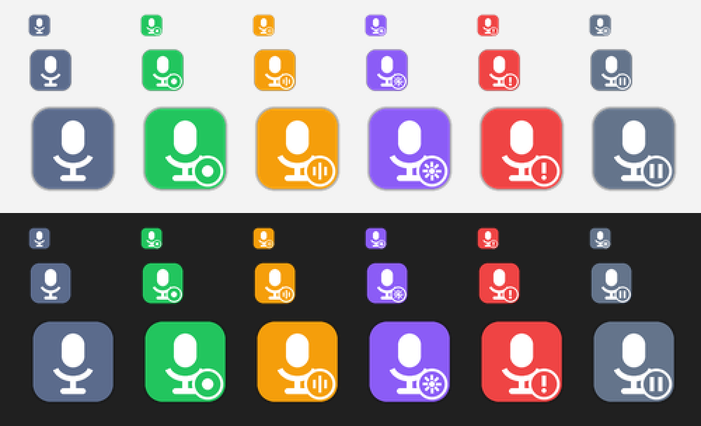

- **Azul-acinzentado, sem símbolo** — aguardando reunião
- **Verde, ponto** — gravando a reunião, sem carregar a IA
- **Âmbar, três ondas** — separando vozes
- **Roxo, engrenagem** — processando a reunião depois do encerramento
- **Cinza, duas barras** — gravação automática pausada
- **Vermelho, exclamação** — erro crítico (reverte após ~30 s)

### Notificações

- Durante a reunião não aparecem trechos, balões, janelas ou sons por bloco.
- O estado fica no ícone, tooltip e primeira linha do menu.
- Ao terminar ou falhar o processamento, pode aparecer uma única notificação
  usando o mesmo ícone da bandeja.

### Como abrir e fechar

O Transkriptor **não usa atalho de teclado**. Para abrir, dê **dois cliques** no atalho
"Transkriptor" da Área de Trabalho (ou em `iniciar_bandeja.bat` / `transkriptor.pyw`).
O app fica **na bandeja do sistema até ser fechado** pelo menu (**Sair**). Abrir de novo
com ele já rodando apenas avisa que já está em execução — nunca cria segunda instância.

Não existe comando de gravação genérica ou transcrição manual. O atalho `.lnk`
da Área de Trabalho apenas inicia o detector e não tem tecla de atalho associada.

---

## 3. Transcrição automática (Google Meet)

1. Deixe o Transkriptor na bandeja com detecção **ativa**.
2. Entre em uma reunião no Google Meet (Chrome, Edge, etc.) ou no Zoom.
3. Em cerca de 10 segundos, um diálogo pergunta se você quer gravar **antes de abrir**
   o dispositivo ou criar qualquer arquivo.
4. Somente **Sim** inicia a captura. **Não**, falta de resposta em 30 segundos ou
   erro no diálogo não gravam nada e não repetem a pergunta na mesma reunião.
5. Durante a chamada, o app apenas grava o áudio em disco, sem Whisper, diarização,
   trechos na tela ou notificações por bloco.
6. Quando título e extensão deixam de confirmar a reunião por cerca de 30 segundos,
   a captura fecha os WAVs e entra na fila de processamento.
7. O menu passa por `Em fila` → `Processando` → `Pronta` (ou `Falhou`). O
   resultado aparece em `transcricoes/` como `.tkpt` no modo protegido ou `.txt`
   no modo compatível; ambos abrem pelo assistente local.

### Como o Transkriptor sabe que há uma reunião

Ele observa três fontes, mas apenas sinais fortes podem iniciar a gravação ou
mantê-la indefinidamente:

| Sinal | O que observa | Cobre |
|-------|---------------|-------|
| **Título da janela** | `Meet: <nome>`, `Meet – abc-defg-hij`, `<sala> - Google Meet`, `Zoom Meeting` | O caso comum |
| **Microfone em uso** | Indicador auxiliar do Windows | Diagnóstico; nunca inicia nem mantém a gravação sozinho |
| **Extensão do Meet** | A própria página da reunião (opcional — seção 6) | Certeza total |

Por que combinar: o título só mostra a **aba que está na frente**. A extensão do
Meet mantém a reunião confirmada quando você troca de aba. Sem título nem extensão,
a janela de graça termina mesmo que algum programa continue usando o microfone.

Áudio do WhatsApp, música, vídeo, ditado e microfone isolado não iniciam reunião.
Depois do encerramento detectado, nada do restante do computador é capturado.

### O pedido de consentimento

Quando uma reunião é detectada, o Transkriptor abre uma janela própria, sempre
visível e sem travar a reunião, com a fonte detectada ("Detectado: Google Meet"),
uma barra de tempo decrescente e dois botões. Só **Gravar esta reunião** inicia a
captura; **Não gravar**, fechar a janela ou deixar o tempo acabar significam não
gravar. A janela acompanha a escala do Windows (100 %, 150 %, 200 %).

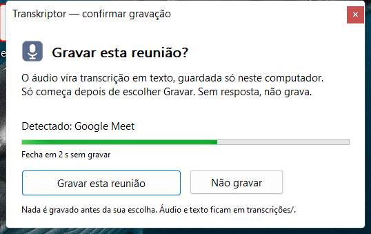

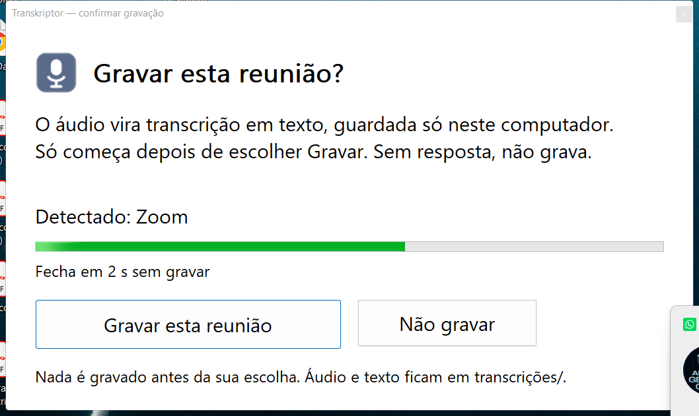

### Arquivos gerados

Para cada reunião processada, conforme o modo de proteção:

- `resultados/<id>.json` no modo compatível ou resultado estruturado cifrado no
  modo protegido — segmentos, atribuições e referências validadas por manifesto.
- `transcricao_*.tkpt` — **arquivo principal no modo protegido**, aberto pelo
  Transkriptor. A exportação em `.txt` é uma ação explícita e sensível.
- `transcricao_*.txt` — **arquivo principal no modo compatível**, UTF-8 legível;
  pode ter cópia `.tkpt` opcional. Arquivos legados permanecem acessíveis.
- `audio/*_audio.tks` e `audio/*_mic.tks` — loopback e microfone em TKAS/1 no
  modo protegido. No modo compatível, os áudios legados podem ser `.wav`.
- `.jobs_processamento/*.json` — estado técnico da fila, sem conteúdo falado.

O áudio é mantido quando o processamento falha, para permitir nova tentativa.
Quando o resultado existe, a retenção remove áudios antigos conforme a configuração.

### Por que não grava outros áudios

Não há botão que ignore o detector. A captura só nasce depois de uma fonte forte
de Meet/Zoom e do seu **Sim**. Ao perder a fonte forte, ela termina mesmo se o
WhatsApp, navegador, player ou microfone continuarem produzindo áudio.

---

## 4. Diarização (separação de vozes)

Com **separação de vozes** ativa, o worker de processamento após a reunião:

1. Analisa trechos de áudio com modelo ECAPA (SpeechBrain)
2. Agrupa vozes semelhantes em `FALANTE_00`, `FALANTE_01`, …
3. No modo compatível, gera `*_diarizado.txt` com formato:

```
[Ana Silva 00:01-00:05] Bom dia a todos.
[VOCÊ 00:05-00:08] Obrigado por participar.
```

No modo protegido, a diarização integra o resultado cifrado; use a exportação
TXT explícita no assistente quando precisar de um arquivo legível.

A diarização roda no subprocesso de prioridade baixa. A bandeja continua
responsiva e consegue detectar e capturar uma nova reunião.

---

## 5. Identificação da sua voz (`VOCÊ`)

O áudio do Meet pelo alto-falante **não inclui sua voz** na maioria dos casos. O Transkriptor usa:

1. **Perfil cadastrado** — 20 s de fala no seu microfone
2. **Gravação paralela do mic** durante a reunião
3. **Matching** por similaridade de embedding na diarização

### Cadastrar perfil

1. Menu → **Cadastrar minha voz (20s)**
2. Após o aviso, fale em voz alta por 20 segundos (leia um texto)
3. Toast confirma **Perfil de voz salvo**

### Usar na reunião

- Mantenha **Identificar minha voz** marcado (✓)
- Use fone ou microfone aberto no Meet
- Se o mic estiver mudo, o reforço `VOCÊ` pode falhar

### Apagar perfil

Menu → **Apagar perfil de voz**

---

## 6. Nomes no Meet (extensão Chrome)

Para substituir `FALANTE_XX` por **nomes reais** dos participantes.

**Guia completo de instalação:** [`extension/meet/README.md`](../extension/meet/README.md) (passo a passo, solução de problemas e privacidade).

### Configuração

1. Menu → **Identificar nomes do Meet** (ativa ponte em `127.0.0.1:5051`)
2. Menu → **Instalar extensão Meet (pasta)** — ou siga o [README da extensão](../extension/meet/README.md)
3. No Chrome: `chrome://extensions` → Modo desenvolvedor → **Carregar sem compactação** → selecione `extension/meet/`
4. Abra a página de **pareamento** da extensão (`pairing.html`), copie o código `pair-…` exibido em **Diagnóstico** na Central, cole e clique em **Parear**. A página mostra o estado: carregando (anel), sucesso (✓, campo travado) ou erro com o próximo passo
5. Entre no Meet com a extensão habilitada

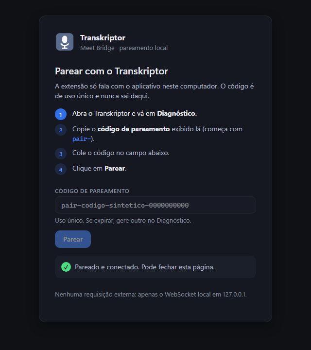

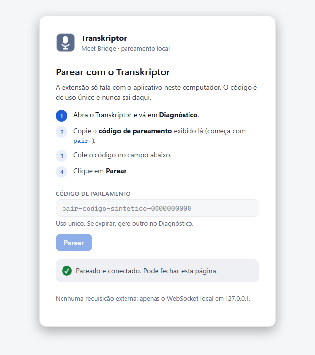

A extensão **não aparece** na reunião como participante nem bot — funciona em silêncio no navegador.

### Modo legendas (recomendado)

1. Menu → **Modo legendas Meet (Tactiq)**
2. Não é preciso ligar as legendas (CC) no Meet: a extensão recebe nome + legenda por um canal próprio na conexão do Meet, invisível na reunião (mesma técnica do Tactiq)
3. Depois de instalar ou atualizar a extensão, recarregue a aba do Meet (F5)

Se o modo legendas estiver ativo mas nenhum evento for recebido, você verá o aviso: *"Nenhum nome recebido do Meet — recarregue a aba e confira o pareamento da extensão"*.

### Prioridade de rótulos

```
Nome do Meet  >  Nome cadastrado (vozes conhecidas)  >  VOCÊ  >  FALANTE_XX
```

### Renomear falante manualmente

Após uma diarização, na Central → **Participantes** (ou Menu → Reuniões ▸
**Renomear falante e participantes (Central)**):

1. Escolha a reunião; cada falante aparece como **Falante 1, 2…** com a sugestão de nome, a origem (legendas do Meet, voz conhecida) e a confiança (ex.: "Ana Souza · legendas · 91 %")
2. **Confirmar** aceita a sugestão; **Escolher outro nome** corrige só esta reunião; **Desfazer** volta a revisão anterior
3. **Aprender voz** é uma ação separada e confirmada: só então o embedding vai para `vozes_conhecidas.enc` para as próximas reuniões

---

## 7. A Central (Início, Reuniões, Assistente, Participantes, Configurações, Diagnóstico)

A Central é a interface principal do Transkriptor: uma página local
(`http://127.0.0.1:PORTA`, porta automática — **5051** reservada para o Meet)
aberta em janela de aplicativo pelo Edge ou Chrome. Tem tema escuro e claro
(segue o Windows; alterne no botão do canto superior direito) e uma barra de
status com o mesmo vocabulário da bandeja: Aguardando reunião, Gravando,
Processando reunião, Separando vozes, Pausado, Erro.

### Abrir

Menu da bandeja → **Abrir Transkriptor** (item padrão; duplo clique no ícone
também abre). A Central só responde ao navegador que recebeu o token da sessão;
nenhuma requisição sai de `127.0.0.1`.

### Início

Estado atual, últimas reuniões, proteção em vigor e atalhos para o Assistente e
o Diagnóstico. Quando algo impede a gravação, o cartão de estado diz o motivo e
o próximo passo.

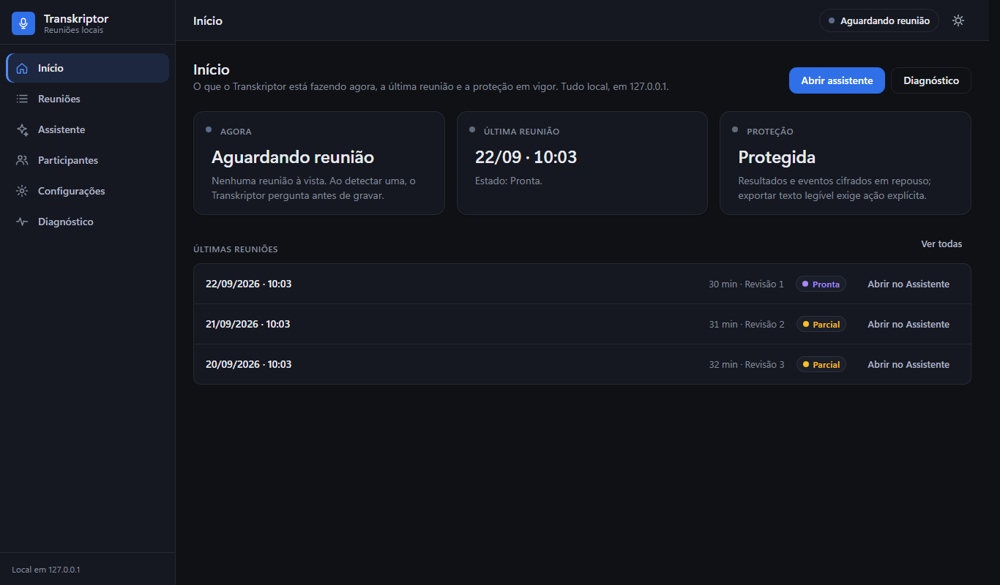

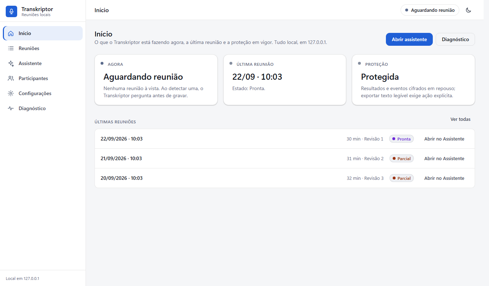

### Reuniões

Lista de todas as reuniões com data, duração, estado (Protegida ou Legível,
Separar vozes, com sua voz) e busca. Setas e Enter funcionam no teclado;
**Abrir no Assistente** leva a reunião selecionada para o chat.

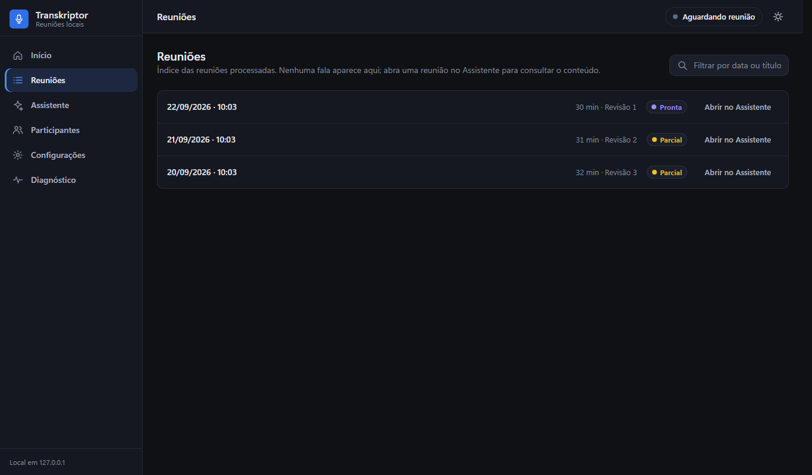

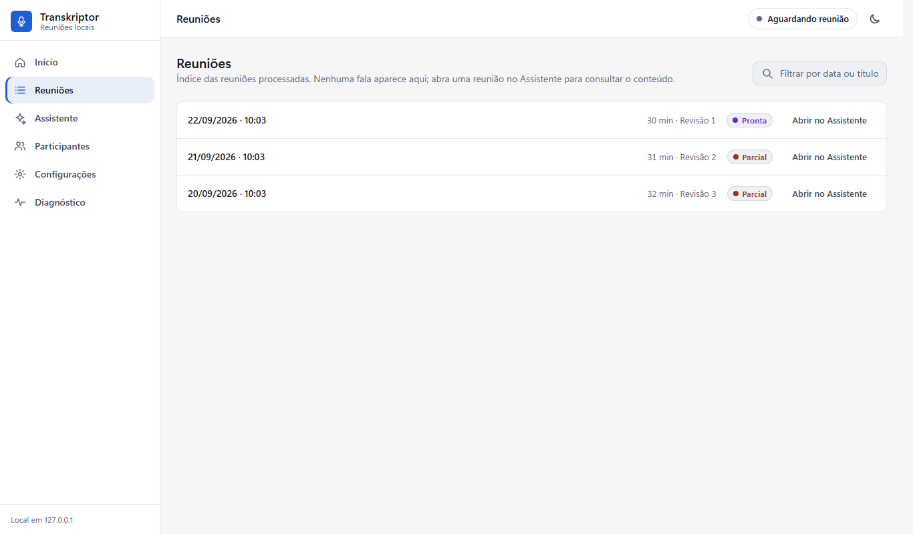

### Assistente (resumo e perguntas)

Pré-requisito: instale e inicie o **Ollama** com pelo menos um modelo (ex.:
`ollama pull llama3.2`).

1. Selecione a reunião na lista à esquerda (as que têm suas falas aparecem marcadas **com sua voz**)
2. Use os atalhos: resumo, pontos principais, tarefas, decisões, próximos passos — ou escreva uma pergunta
3. A resposta chega em texto formatado (títulos, listas, tabelas); **Copiar resposta** guarda a última; `Esc` cancela uma geração em andamento
4. O histórico é por reunião; trocar de reunião troca o contexto

O assistente lê `.tkpt` e `.txt` automaticamente. Um `.txt` do modo compatível
ou exportado pode ser aberto em um editor comum; trate essa cópia como dado sensível.

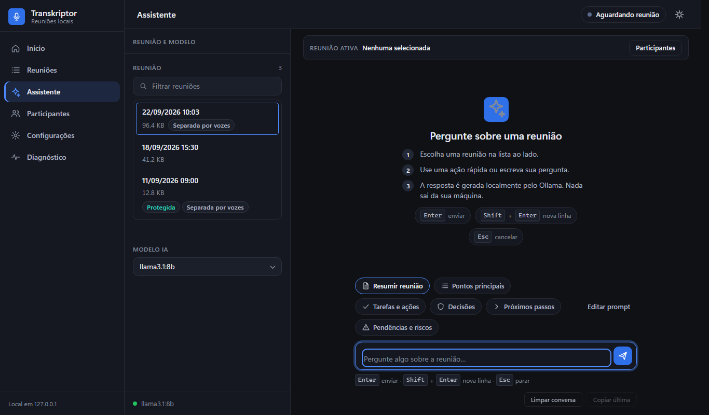

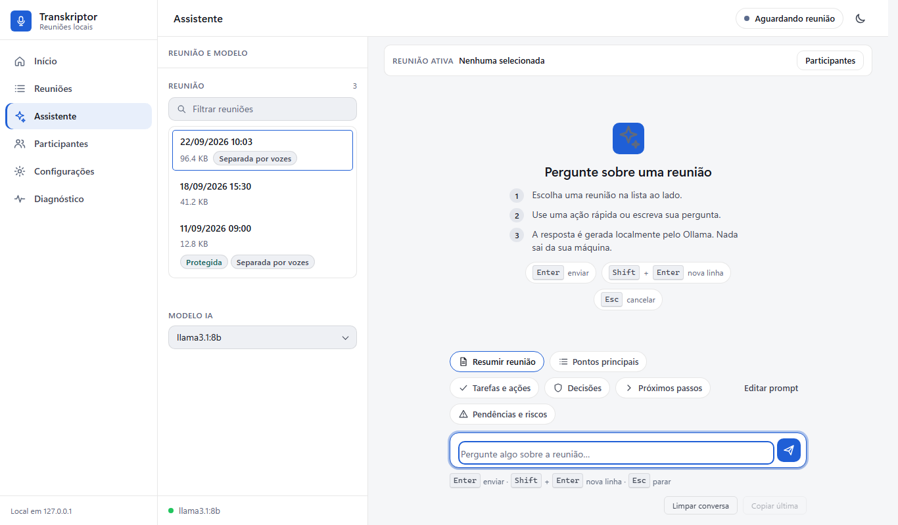

**Sem Ollama:** a transcrição continua funcionando; a Central avisa
"Ollama não respondeu" com o botão **Tentar de novo**, e o restante das páginas
segue disponível.

### Participantes

Revisão de quem falou o quê: falantes com sugestão, origem e confiança
(ex.: "Ana Souza · legendas · 91 %"), confirmação, correção só desta reunião,
**Desfazer** por revisão, **Aprender voz** (ação separada e confirmada) e
**Exportar TXT** (texto legível — pede confirmação e explica a consequência).

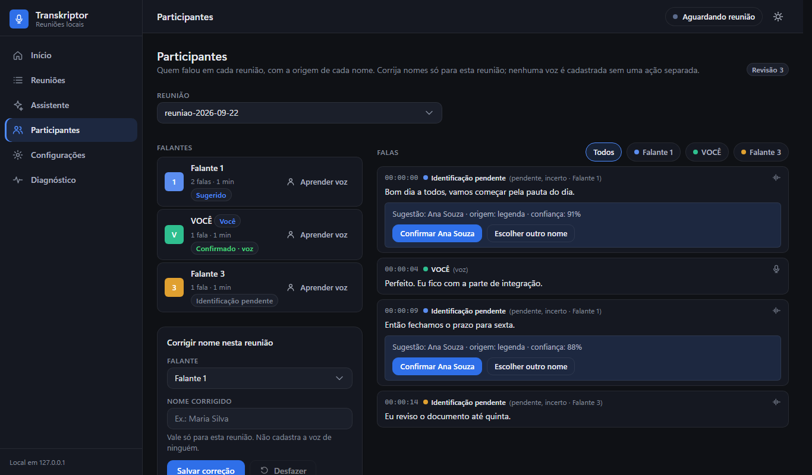

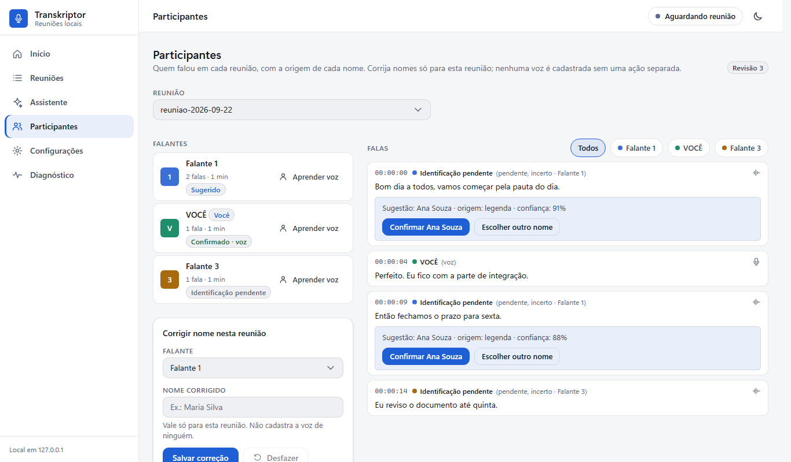

### Configurações

As mesmas opções do menu da bandeja, cada uma com a consequência escrita ao
lado. Mudanças valem na hora e ficam salvas. Ações com efeito irreversível ou
que desligam a gravação pedem confirmação com o **mesmo texto** na Central e na
bandeja; o botão padrão é sempre o seguro (Cancelar / Não).

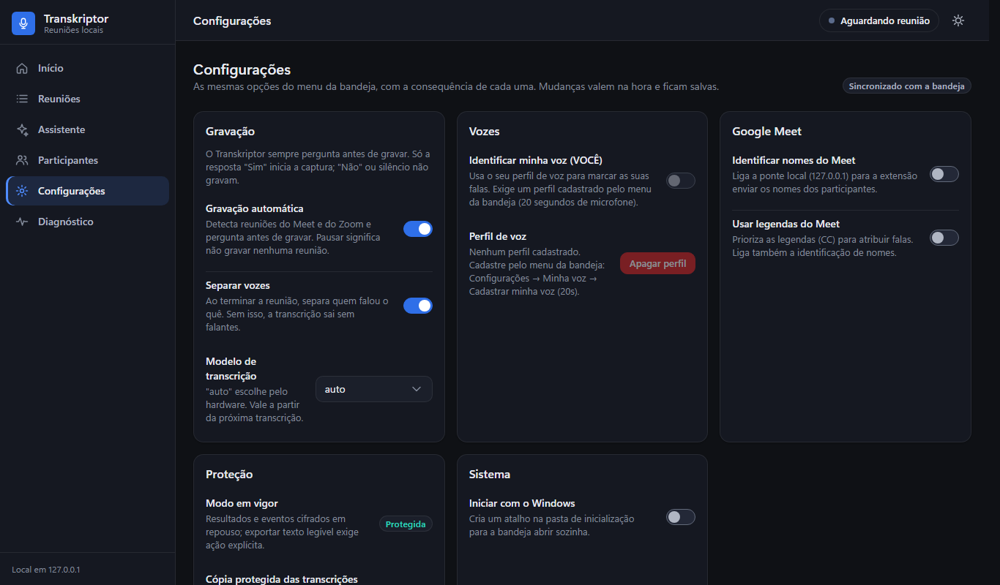

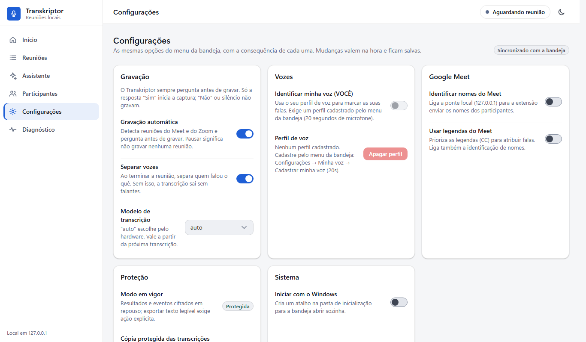

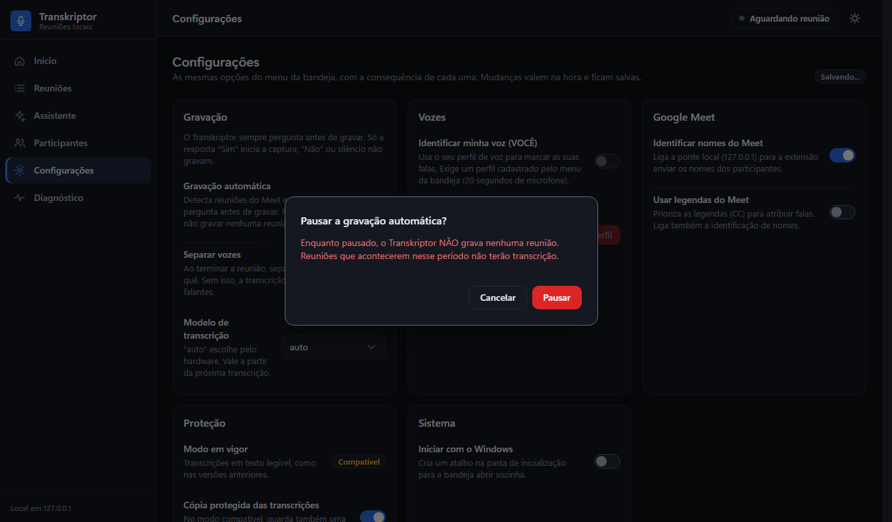

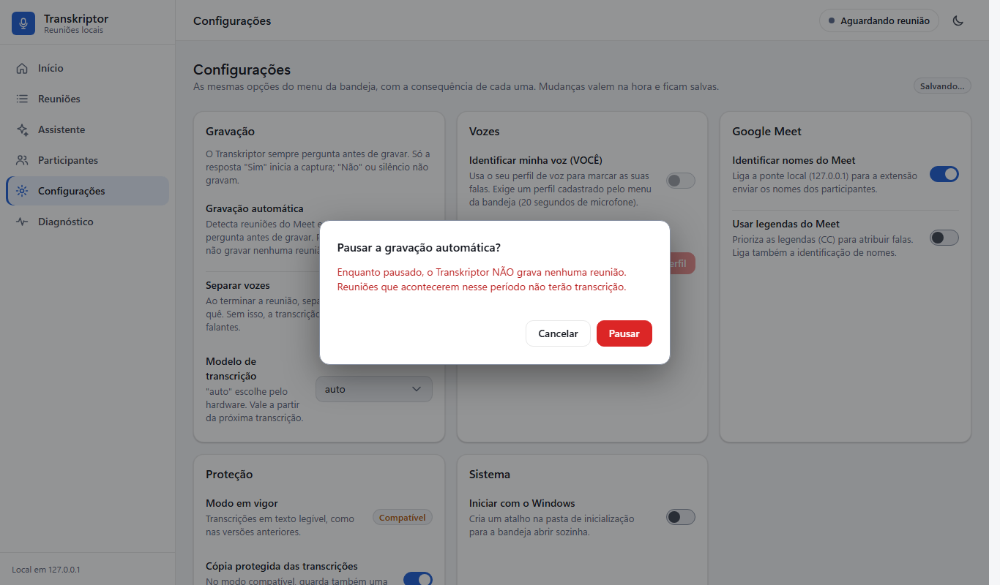

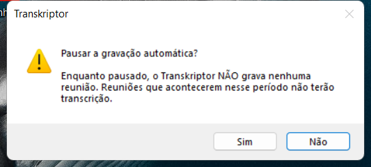

### Diagnóstico

"Por que não está gravando?": roda as verificações de áudio, fontes de reunião
(título, microfone, extensão, Zoom), modelos e pastas; mostra o código de
pareamento da extensão; lista áudios retidos com **Retranscrever**; exporta o
relatório `.txt` sem dados pessoais.

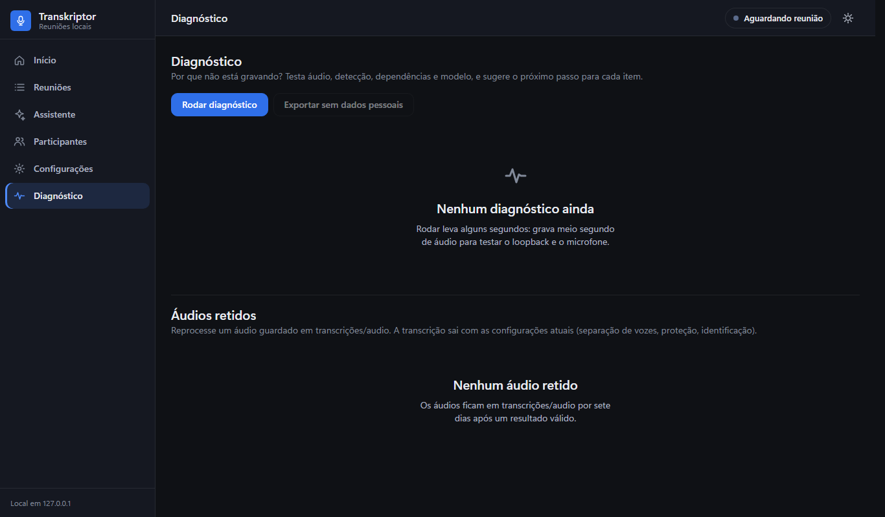

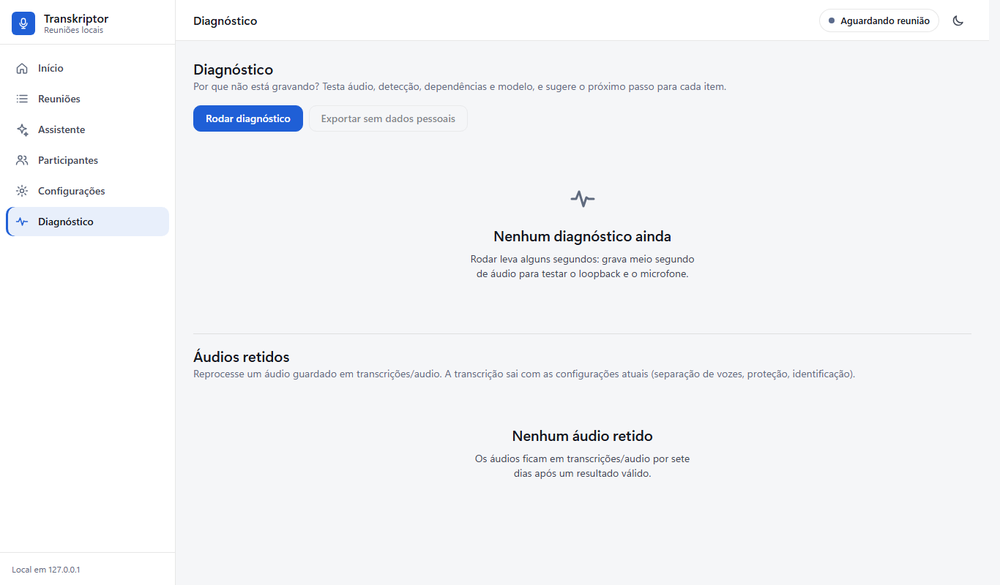

Todas as capturas deste manual são **sintéticas** (nomes e reuniões inventados,
como "Ana Souza"); ver `docs/manual/capturas/README.md`.

---

## 8. Segurança e privacidade (uso local)

| Tópico | Comportamento |
|--------|----------------|
| Rede | Assistente e ponte Meet escutam só em `127.0.0.1` (localhost) |
| API | Rotas `/api/*` exigem sessão local; mutações validam Host, Origin e JSON, e ausência de Origin exige header secreto |
| Arquivos | API rejeita paths com `../` (403) |
| XSS | Nomes de arquivo não são injetados via `innerHTML` no assistente |
| Logs | Conteúdo de transcrições **não** é gravado no log |
| Dados sensíveis | `transcricoes/`, perfil de voz e vozes conhecidas ficam locais |
| Criptografia em repouso | Instalação nova usa `.tkpt`, áudio TKAS/1 (`.tks`) e resultado estruturado cifrado; chave local protegida por DPAPI |
| Instância única | Mutex impede duas cópias simultâneas |

### Modo protegido e compatibilidade

- Instalação nova usa **modo protegido**: `.tkpt`, TKAS/1 e resultado estruturado
  cifrado. Esses arquivos não são legíveis em um editor comum.
- Instalação existente sem preferência registrada permanece no modo compatível;
  o `.txt` principal continua legível até escolher **Ativar modo protegido para
  novas reuniões…** no menu da bandeja e confirmar. Faça a mudança após a
  gravação e o processamento terminarem.
- Em **Assistente → Participantes**, selecione a reunião e use **Exportar TXT**.
  Confirme o aviso: o navegador baixa um arquivo legível, sensível, e o app não
  grava uma cópia TXT no servidor durante essa exportação.
- Ativar proteção não apaga automaticamente arquivos antigos em claro. Revise as
  cópias e exportações antes de movê-las ou compartilhá-las.
- Se a chave DPAPI não puder ser aberta, o app sinaliza `protection_pending` e
  preserva a fonte para recuperação; não considera a proteção concluída.

### Boas práticas

- Restrinja o acesso à pasta `transcricoes/`, sobretudo a `.txt` antigos ou exportados.
- Não copie `transkriptor_key.dpapi` entre usuários Windows diferentes (a chave é por usuário).
- Feche o assistente quando não estiver em uso (aba do navegador).
- Mantenha o Windows e o Chrome atualizados.

### Voz, retenção e responsabilidade

- **Perfil de voz desligado por padrão.** O cadastro exige finalidade e
  consentimento explícitos no ato; sem cifra disponível, o cadastro é
  recusado em vez de salvar em claro. A correção de um nome numa reunião
  nunca cadastra biometria (ação separada e revogável).
- **Revogação verificável.** Apagar o perfil remove os dois arquivos e
  confirma a ausência; só o perfil selecionado é removido.
- **Retenção.** Áudio e eventos brutos: 7 dias após resultado válido.
  Transcrições/resultados: até exclusão manual. Perfil de voz: até revogação.
- **Diagnóstico sem PII.** A exportação remove paths pessoais, credenciais,
  títulos e nomes de detecção; logs usam códigos de evento, nunca fala.
- **Responsável e base.** O operador que consente cada gravação é o
  responsável pelos dados; use o app conforme a legislação aplicável
  (ex.: LGPD no Brasil). Nenhum checkbox substitui essa avaliação.

---

## 9. Configurações (`config_user.json`)

Arquivo na raiz do projeto (criado/atualizado pelo menu):

```json
{
  "versao_config": 2,
  "iniciar_com_windows": false,
  "protection_mode": "protected",
  "criptografar_transcricoes": true,
  "backup_txt_na_migracao": false,
  "identificar_minha_voz": true,
  "rotulo_usuario": "VOCÊ",
  "capturar_mic": true,
  "usar_nomes_meet": false,
  "modo_legendas_meet": false,
  "meet_bridge_token": "<gerado automaticamente>"
}
```

Constantes globais ficam em `config.py` (modelo Whisper, portas, limiares). A
confirmação antes de gravar é obrigatória e não aparece como configuração. A
chave DPAPI fica no arquivo dedicado `_modelo_voz/transkriptor_key.dpapi`.

---

## 10. Solução de problemas

### Ícone não aparece na bandeja

- Clique na seta **^** na barra de tarefas
- Verifique se não há segunda instância bloqueada no log

### Nada é gravado — comece pelo Diagnóstico

Menu da bandeja → **Diagnóstico (por que não está gravando?)**. Ele grava meio
segundo de áudio de verdade, consulta as três fontes de detecção e abre um
relatório dizendo, item a item, o que está `OK`, `AVISO` ou `ERRO`.

Leia primeiro as linhas com **ERRO** — são as que impedem a gravação. `AVISO`
costuma ser normal (por exemplo, "loopback em silêncio" quando nada está tocando).

### Meet não inicia transcrição

- Confirme que a detecção não está pausada (o status do menu diz o que ele vê agora)
- Confirme que respondeu **Sim** ao diálogo; qualquer outra resposta não grava
- Rode o **Diagnóstico** e veja a linha `Fonte: titulo` — ela mostra se alguma
  janela foi reconhecida
- Com `exigir_janela_visivel` ativo, janela minimizada não conta

### WhatsApp, vídeo ou música iniciou gravação

Microfone e áudio do sistema, sozinhos, não iniciam reunião.
Abra o menu e confirme o status. Se estiver `Gravando reunião`, use **Diagnóstico**
para identificar qual título ou extensão está sendo tratado como fonte forte e
anexe o relatório ao suporte; ele não inclui o conteúdo falado.

### Gravou, mas a transcrição saiu vazia

Sinal clássico de captura de áudio quebrada: o arquivo em `transcricoes/audio/`
fica com pouquíssimos bytes.

- Rode o **Diagnóstico**: a linha `soundcard` aponta incompatibilidade de versão
- Confira `pip check` na `.venv` e reinstale pelo `instalar.bat` se a instalação
  estiver incompleta; não atualize pacotes isolados fora do lock.
- Confira também se o dispositivo de saída do Windows não mudou (fone conectado
  no meio da reunião)

### "Já está em execução" mas não há ícone na bandeja

O controle de instância única usa um mutex do Windows. Confira pelo Gerenciador
de Tarefas se o processo do Transkriptor desta instalação ainda está ativo e
saia pelo menu da bandeja quando possível. Se o aviso persistir, use o
Diagnóstico; não encerre outros processos Python nem apague locks às cegas.

### Diarização não gera arquivo

- Verifique se **separação de vozes** está ativa
- Reunião muito curta pode ter poucos segmentos (1 falante apenas)
- Veja erros em `transkriptor.log`

### O áudio existe, mas o texto ainda não apareceu

- Veja a primeira linha do menu: `Em fila` e `Processando` ainda não são erro
- `Pronta` indica um resultado validado em `.tkpt` ou `.txt`, conforme o modo
- `Falhou` preserva o áudio em `transcricoes/audio/`; use **Retranscrever áudio…**
- O primeiro processamento pode demorar mais por causa do download dos modelos

### `VOCÊ` não aparece

- Cadastre o perfil de voz (20 s)
- Ative **Identificar minha voz**
- Verifique se o microfone captura durante a reunião
- Headset com cancelamento agressivo pode atrapalhar

### Nomes do Meet não aparecem

- Extensão instalada e Meet aberto no Chrome?
- **Identificar nomes do Meet** ativo na bandeja?
- Legendas CC ativas (modo Tactiq)?
- Firewall bloqueando `127.0.0.1:5051`?

### A Central ou o Assistente não abre

- Menu → **Abrir Transkriptor**; se nada aparecer, veja `transkriptor.log` (porta ocupada — o app tenta portas alternativas)
- A Central abre, mas o Assistente diz "Ollama não respondeu": Ollama rodando? (`ollama serve`); depois **Tentar de novo**
- Aguarde até 10 s no primeiro acesso

### Transcrições ilegíveis ou erro ao abrir arquivo

- Abra `.tkpt` pelo assistente local; `.txt` é legível apenas no modo compatível
  ou quando foi exportado explicitamente
- Chave DPAPI inválida: verifique se está no mesmo usuário Windows que criou os arquivos
- Reinicie o app após trocar de conta Windows

### Erro crítico (ícone vermelho)

- Abra **Abrir log** no menu
- Reinicie o Transkriptor
- Verifique espaço em disco e permissões da pasta

---

## 11. Estrutura de pastas

```
Transkriptor/
├── transkriptor.pyw         # App principal (bandeja)
├── app_processamento.py     # Fila e worker depois da reunião
├── crypto_storage.py        # Criptografia .tkpt / .enc
├── transcricao_core.py      # Captura leve; IA opcional fora da reunião
├── fila_processamento.py    # Jobs atômicos pending/processing/ready/failed
├── processador_reuniao.py   # Subprocesso Whisper/diarização
├── retranscritor.py         # Geração do texto exportável
├── assistente.py            # Interface web + Ollama
├── diarizador.py            # Separação de vozes
├── identificador_voz.py     # Perfil VOCÊ + vozes conhecidas
├── meet_bridge.py           # WebSocket Meet
├── correlacionador.py       # Nomes ↔ segmentos
├── extension/meet/          # Extensão Chrome (+ README de instalação)
├── transcricoes/            # Resultados protegidos ou compatíveis
├── _modelo_voz/             # Perfil (.enc) e vozes conhecidas
└── docs/                    # Documentação
```

---

## 12. Suporte e verificação técnica

Desenvolvedores podem validar a instalação:

```bash
python scripts/verificar_fase.py --fase all
python -m pytest tests/ -v --tb=short
```

O gate Windows de recursos recebe o PID do processo da bandeja e mede 10 minutos,
sem ler títulos, áudio ou transcrições:

```bash
python scripts/verificar_recursos_gravacao.py --pid 12345 --duracao 600
```

Ele exige crescimento menor que 100 MB, CPU média menor que 10% de um núcleo e
um único ícone pystray. Documentação SDD: remediação em `docs/sdd/v1.8/`; interface (Central e design system) em `docs/sdd/v1.9/`.

---

## 13. Glossário rápido

| Termo | Significado |
|-------|-------------|
| Loopback | Captura do áudio que sai no alto-falante do PC |
| Diarização | Separação automática de quem falou o quê |
| Whisper | Motor de transcrição offline usado pelo Transkriptor |
| Ollama | Servidor local para modelos de linguagem (assistente) |
| ECAPA | Modelo de embedding de voz usado na identificação |
| CC / Legendas | Closed Captions do Google Meet |
| `.txt` | Resultado compatível ou exportação explícita, legível em UTF-8 |
| `.tkpt` | Resultado principal protegido; também pode ser cópia do modo compatível |
| `.tks` | Áudio protegido em stream TKAS/1 |
| `.enc` | Perfil de voz e vozes conhecidas criptografados |
| DPAPI | Proteção da chave mestra pelo Windows (por usuário) |
| Central | A interface principal (Início, Reuniões, Assistente, Participantes, Configurações, Diagnóstico), local em 127.0.0.1 |
| Reunião | Item da lista, com data, duração e estado; a transcrição é o texto produzido dela |
| Transcrição | O texto produzido de uma reunião (não o nome do item) |
| Falante 1, 2… | Voz separada pela diarização ainda sem nome |
| Participante | Pessoa identificada pelo Meet ou por você |
| VOCÊ | Você, identificado pelo perfil de voz |
| Identificação pendente | Falante sem evidência suficiente para receber um nome |
| Sugestão | Nome proposto para um falante, com origem (legendas, voz conhecida) e confiança |
| Protegida / Legível | Resultado cifrado (`.tkpt`) / em texto claro (`.txt`) |
| Separar vozes | A diarização, como aparece nos menus e badges |
| Estados | Aguardando reunião · Gravando · Processando reunião · Separando vozes · Pausado · Erro — os mesmos na bandeja, no ícone e na Central |

---

*Transkriptor — Manual do usuário — 2026*
