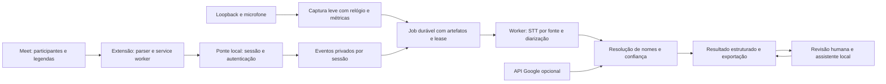

# Concept — confiabilidade e participantes identificados

## Problema e resultado

O usuário precisa terminar uma reunião com todas as falas capturadas, nomes quando sustentados por evidência, indicação de lacunas e um resultado fácil de revisar. Hoje os componentes de nomes existem, mas os eventos não chegam ao worker; o microfone não fornece texto próprio e falhas parciais podem parecer conclusão normal.

A evolução deve entregar uma transcrição por reunião, com participantes e atribuições rastreáveis, suporte a correção posterior e estados de integridade e proteção que correspondam aos artefatos reais.

## Escopo

Núcleo obrigatório: governança SDD, captura/filas, duas fontes de áudio, extensão Meet, persistência de eventos, resolução conservadora de identidade, revisão nominal, proteção em repouso, assistente consistente, testes comportamentais e release reproduzível.

Complemento opcional: importar participantes e transcrição oficial via OAuth. Experimento separado: Meet Media API. Zoom continua suportado na detecção/captura; nomes automáticos de Zoom não fazem parte desta proposta.

Fora do escopo: bot que entra em reuniões sem operador, reconhecimento universal de desconhecidos por voz, scraping de perfis externos, envio de áudio para SaaS, certificação legal, publicação automática ou mudanças em contas Google nesta etapa.

## Arquitetura proposta

`Transcritor` permanece núcleo da captura. Componentes novos têm fronteiras pequenas: `sessao_reuniao.py`, `eventos_meet_store.py`, `identidade_reuniao.py`, `resultado_reuniao.py`, `fila_lock.py`, `politica_privacidade.py` e adaptadores de áudio/Google. Não criar uma segunda implementação de captura.

Jobs guardam IDs, estados e referências relativas aos artefatos; conteúdo de legenda, nomes e embeddings ficam em armazenamento privado separado. Participante, cluster acústico e nome exibido são entidades diferentes. Um cluster pode ter atribuição incerta, e uma pessoa pode ter múltiplos dispositivos/sessões.

## Decisões

- As decisões DU-01–DU-16 de `decisoes-usuario.md` foram confirmadas pelo usuário e são normativas.
- Uma gravação ativa por aplicativo; várias abas são distinguidas. Não somar automaticamente duas conferências diferentes.
- O instante zero é o primeiro frame confirmado, com relógio monotônico por fonte e âncora UTC; eventos do navegador têm sequência e sincronização explícitas.
- O arquivo estruturado da reunião é a fonte do resultado. TXT é exportação `[HH:MM:SS] Nome: texto`; instalação existente sem escolha preserva modo compatível e instalação nova inicia protegida.
- Atribuição automática deve favorecer precisão: exige ≥98% de precisão seletiva e ≥80% de cobertura elegível. Conflito ou evidência insuficiente produz `Identificação pendente`. Limiares são calibrados em corpus separado da avaliação.
- Correção do nome numa reunião não cadastra biometria automaticamente. Aprendizado persistente é uma ação separada e revogável.
- Falha de diarização/identidade não destrói o STT concluído; resultado informa quais etapas estão completas, parciais ou falharam.
- A política atual de TXT legível é preservada em instalações existentes no modo compatível. Instalações novas começam protegidas; exportar TXT nesse modo exige ação explícita.
- Falha de proteção não vira sucesso silencioso. Gravação já em curso é preservada em área restrita e sinalizada; cadastro biométrico novo falha fechado.
- Desligar nomes permite heartbeat mínimo de detecção, mas suspende coleta/persistência de conteúdo de legendas e roster.
- Áudio e eventos Meet obedecem retenções de sete dias vinculadas a resultado válido; transcrição/resultado ficam até exclusão manual e perfil de voz até revogação.
- CPU e CUDA são rotas suportadas. Chrome e Edge são obrigatórios; nomes automáticos de Zoom permanecem fora do escopo.
- Falhas parciais preservam dados íntegros e nunca são apresentadas como sucesso global.

## Critérios de sucesso

Em reunião consentida com três participantes, primeiro no Chrome e depois no Edge para Windows, com legendas ativas, as falas locais/remotas devem aparecer no resultado, nomes corretos devem ter proveniência e nomes ambíguos devem permanecer pendentes. Reiniciar após a captura não perde eventos nem duplica jobs. Trocar de reunião no assistente não transporta conversa anterior.

Metas numéricas, corpus, falhas injetadas e gates estão em `spec.md`/`plan.md`. São metas propostas, não desempenho medido nesta auditoria.
