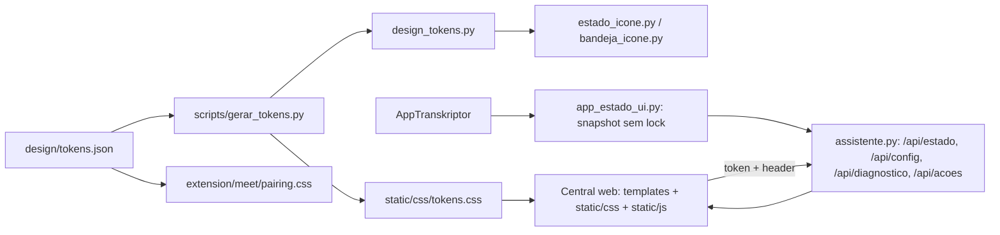

# Concept — Transkriptor como plataforma profissional (SDD v1.9)

## Problema e resultado

O Transkriptor tem engenharia de produto sério (consentimento fail-closed, proteção em repouso, resultado estruturado com proveniência) apresentada por cinco linguagens visuais desconexas, um menu de bandeja com 24 itens e um assistente que quebra sob a própria CSP. O usuário percebe um script, não uma plataforma.

Resultado esperado: uma única linguagem visual, sóbria e tecnológica, aplicada a todas as superfícies; uma Central web local que concentra estado, reuniões, assistente, revisão de participantes, configurações e diagnóstico; e momentos nativos (ícone, menu, consentimento) redesenhados com a mesma identidade. Tudo sem alterar as garantias de privacidade, os contratos de dados da v1.8 nem o núcleo de captura.

## Conceito: "sala de controle silenciosa"

Durante a reunião o produto é invisível e confiável; depois dela, é preciso e revisável. A interface deve comunicar exatamente isso:

1. **Estado sempre visível, nunca ruidoso.** Um único vocabulário de estados (aguardando, gravando, processando, separando vozes, pausado, erro) com a mesma cor, forma e texto no ícone da bandeja, no menu, na barra superior da Central e nas notificações.
2. **Uma linguagem para tudo.** Tokens de design em fonte única geram o CSS da Central, as cores do ícone e a página da extensão. Grafite como base, um acento azul elétrico para ação, cores semânticas para estado. Sem serifa, sem dourado, sem vidro fosco, sem brilho.
3. **Sobriedade com dados sensíveis.** Nenhuma fala aparece em listas por padrão. Estados de proteção (compatível/protegido, cifrado/legível) são badges consistentes, não jargão de extensão de arquivo. Exportar texto legível é uma ação deliberada com diálogo próprio.
4. **Densidade de ferramenta profissional, desktop-first.** Janela ≥ 900 px é o alvo. Listas em linhas, números tabulares, coluna de leitura de 72 caracteres, painéis laterais em vez de modais. Mobile continua sem quebra, mas não dita o layout.
5. **Movimento funcional.** Transições de 120–240 ms, ease-out, apenas para indicar causa e efeito. `prefers-reduced-motion` desliga tudo.
6. **Acessível por padrão.** Contraste AA verificado por cálculo sobre os tokens, teclado completo, nomes acessíveis, `forced-colors`, foco visível de dois tons.
7. **O nativo com dignidade.** Onde o Windows é obrigatório (bandeja, consentimento), o Windows é feito bem: ícone vetorial multi-resolução, DPI tratado, hierarquia tipográfica, `checked` nativo no menu.

## Escopo

**Núcleo obrigatório (F14.A–F14.G):** tokens e temas; correção da CSP e remoção de estilo inline; app shell da Central; lista de reuniões sobre o índice paginado; conversa com markdown completo e ações rápidas como intenções; painel de participantes e revisão; página Início com estado ao vivo; Configurações e Diagnóstico na web; retranscrição e correção de nomes migradas dos diálogos Tk para a Central; ícone e menu da bandeja; consentimento redesenhado; pareamento da extensão; gate de acessibilidade e orçamento de front; manual e evidências.

**Fora do escopo:** alterar captura, fila, worker, diarização, identidade, criptografia ou contratos de dados da v1.8; qualquer requisição de rede fora de `127.0.0.1`; fontes ou bibliotecas via CDN; framework de front (React/Vue) ou bundler; empacotamento como app desktop (Electron/pywebview); mudança de nome do produto (decisão separada); nomes automáticos de Zoom; mobile como plataforma alvo.

**Dependências com a v1.8:** a v1.9 consome o índice paginado (T-13.F3), o resultado estruturado (T-13.D7), a política de proteção (T-13.E1) e a validação de mutações (T-13.E3). Não reabre nem substitui tarefas v1.8. Execução da v1.9 só começa depois de a remediação v1.8 em curso estar commitada; enquanto isso, este SDD é proposta.

## Arquitetura de interface

- **Central** é o Flask atual (`assistente.py`) com rotas novas e páginas novas, servido em `127.0.0.1`, no mesmo processo da bandeja quando aberto pelo menu. Não há segundo servidor.
- **Estado** vem de `app_estado_ui.snapshot(app)`, que lê atributos sem pedir `self._lock` (mesma regra de `_texto_status`), e é publicado por um provedor registrado no Flask. Nunca contém conteúdo de fala, nomes de participantes, tokens ou caminhos pessoais.
- **Mutações** (toggles de configuração, retranscrever, corrigir nome) passam por `assistente_validacao.validar_mutacao_local` e exigem o header secreto; as confirmações que hoje são `MessageBoxW` viram diálogos da Central com a mesma semântica e o mesmo texto de consequência.
- **Bandeja** mantém o menu como lançador e indicador: "Abrir Transkriptor" no topo, estado na primeira linha, ações frequentes, submenu único de configurações rápidas. Tudo que exige tela migra para a Central.
- **Tokens** têm fonte única em JSON; um gerador produz CSS e Python. Um teste garante que os três estejam sincronizados, no mesmo espírito de `config.VERSAO`.

## Decisões de design

- Base grafite neutra (não azul-escuro, não preto puro) em dois temas; acento único azul elétrico; estados semânticos fixos: gravando verde, processando violeta, separando vozes âmbar, erro vermelho, pausado cinza, aguardando azul-acinzentado. As cores do ícone da bandeja passam a ser esses tokens.
- Tipografia do sistema: `"Segoe UI Variable Text", "Segoe UI", system-ui`; monoespaçada `"Cascadia Code", Consolas`. Nenhuma fonte baixada: CSP `'self'` e zero rede. Escala de sete tamanhos (12–32 px) e três pesos (400/500/600).
- Ícones em sprite SVG interno (`static/icones.svg`, `<use href>`), traço 1,5 px, grade 20 px. Sem emoji em interface, sem caracteres de desenho ("●", "☰") como ícones.
- Superfícies planas com bordas de 1 px e três níveis de elevação discretos. Sem `backdrop-filter`, sem radiais de brilho, sem textura.
- Componentes: botão (primário/secundário/silencioso/perigo), campo, seleção, listbox, badge de estado, badge de proteção, toast tipado, diálogo, painel lateral, skeleton, estado vazio, tabela/linha de dados, barra de progresso determinada e indeterminada, chip de intenção.
- IDs de elementos usados pelos testes E2E são contrato estável (`interfaces.md`). Quando o controle muda de natureza (por exemplo `<select>` → listbox), o teste é migrado na mesma task, nunca apagado.
- Vocabulário único: **Reunião** (não "transcrição") para o item de lista; **Participante** e **Falante** com definição no glossário; **Protegida** e **Compatível** para política; **VOCÊ** mantém o rótulo do usuário; `FALANTE_XX` nunca aparece sem um nome amigável ao lado ("Falante 1").
- O consentimento continua Win32 (independe do navegador e do Flask) e ganha DPI, ícone, hierarquia e contagem visual. Suas garantias e testes existentes permanecem intocados.
- Nada da v1.9 altera `config.VERSAO`; o bump é decisão de release.

## Critérios de sucesso

- Abrir a Central sob a CSP endurecida sem nenhuma violação no console e sem estilo inline no HTML.
- Um usuário novo, com o app aberto e sem reunião, entende em uma tela o que o produto está fazendo, qual foi a última reunião e o que fazer para gravar a próxima.
- Uma revisão de participantes (confirmar sugestão, corrigir, desfazer, exportar) é concluída sem digitar identificadores técnicos.
- Todas as superfícies passam no gate: contraste AA calculado nos tokens, `axe` sem violações sérias, teclado completo, 900/1366/1920 px sem overflow, 375 px sem quebra.
- Capturas sintéticas de todas as superfícies no manual, com a mesma identidade visível do ícone da bandeja à página de pareamento.
